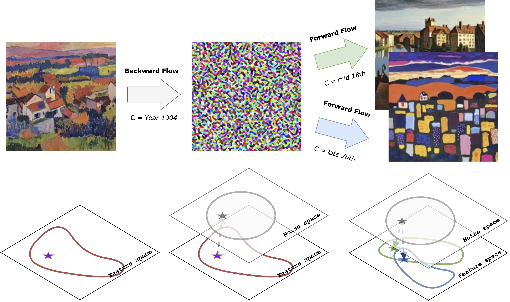
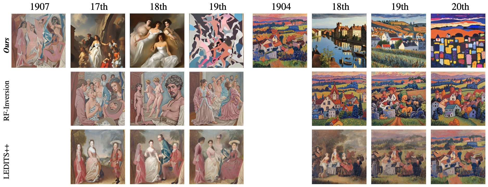
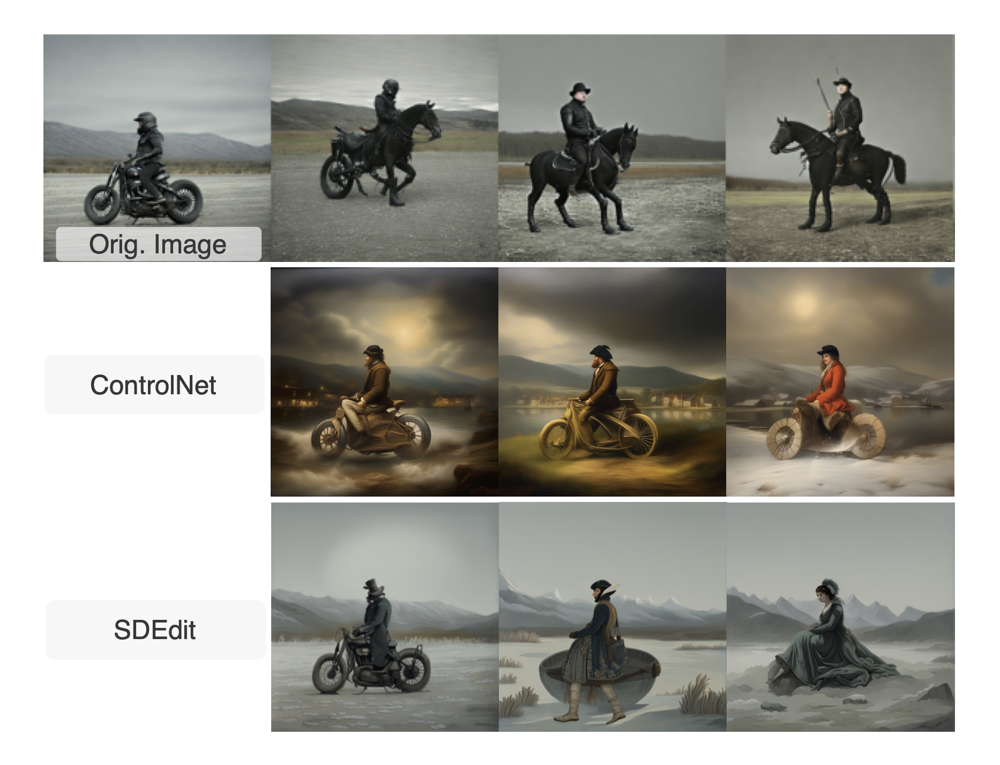
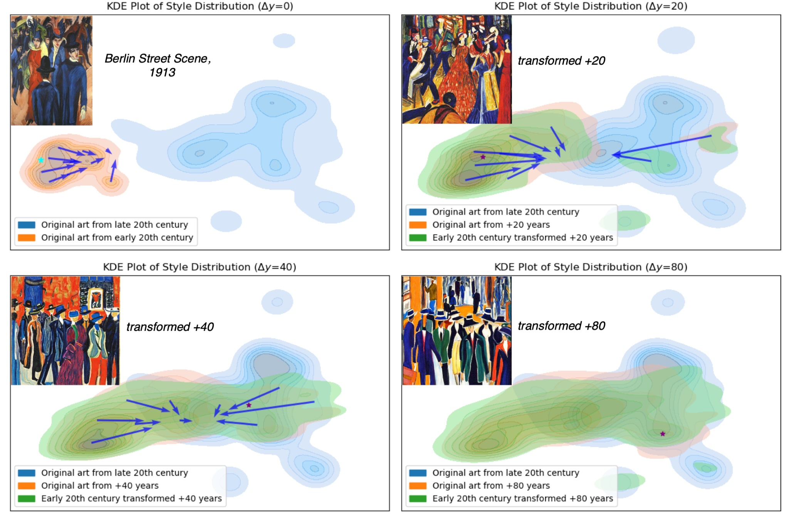

<div align="center">

<h2>Stochastic Interpolants for Revealing Stylistic Flows across the History of Art</h2>

<p>
  Pingchuan Ma<sup>*</sup>, Ming Gui<sup>*</sup>, Johannes Schusterbauer, Xiaopei Yang, Olga Grebenkova, Vincent Tao Hu, Björn Ommer<br>
  <p align="center"> 
   <b>CompVis Group @ LMU Munich</b> &nbsp;&nbsp;&nbsp; <b>Munich Center for Machine Learning (MCML)</b> 
 </p>
  <sup><strong>*</strong></sup><i>equal contribution</i>
</p>

<p align="center"><strong>📄 ICCV 2025</strong></p>
</div>
<!-- <a href=""></a> -->

## 🔥 TL;DR

We introduce a generative framework that models the temporal evolution of artistic styles as an optimal transport problem in a learned style space.
By combining stochastic interpolants with diffusion implicit bridges, we align artistic distributions across centuries without paired data, revealing how visual styles flow through time.

## 📝 Overview

Modern generative models excel at creating art, but they typically focus on individual images rather than capturing stylistic dynamics through history.
We address this by modeling art evolution as distribution matching over time, instead of per-image style transfer.
We train a chronologically conditioned flow-matching model that learns a smooth vector field in a compact semantic style space.
This allows us to transport embeddings from one historical period to another, tracing stylistic shifts across decades or centuries: from the Renaissance to Modernism and beyond.

<p align="center">

</p>

## 📈 Results

Our method projects any given artwork to earlier or later time periods, showing how it might look if it had existed decades apart, while maintaining better semantic alignment over time, whereas others are constrained by pixels.

<p align="center">

</p>

Content semantics are preserved across time by transforming a motorcyclist to the year 1800; low flexibility (left) keeps the model too close to the original input, producing incorrect or hybrid *Steam Horse locomotive* that blend features from both eras, while higher flexibility enables a correct transition from “a man on a motorcycle with wheels” to “a man on a horse,” capturing both semantic identity and the stylistic context of time.  

<p align="center">

</p>

Stylistic flows over time. We visualize distribution shifts for $\Delta y\!=\!0,20,40,80$ years. Blue quivers indicate the dominant movements of art pieces into the next time frame and visualize how style distribution flows across time.  Each subplot displays kernel density estimates (KDEs)for three sets of samples: the original early-century inputs transported by our model, the real artworks from the corresponding future time window, and the fixed target distribution of late-20th-century art.  
<p align="center">

</p>

## 🛠️ Usage and  🗂️ Dataset
WIP

## 🎓 Citation

If you use our work in your research, please use the following BibTeX entry

```bibtex
@InProceedings{
    TODO
}
